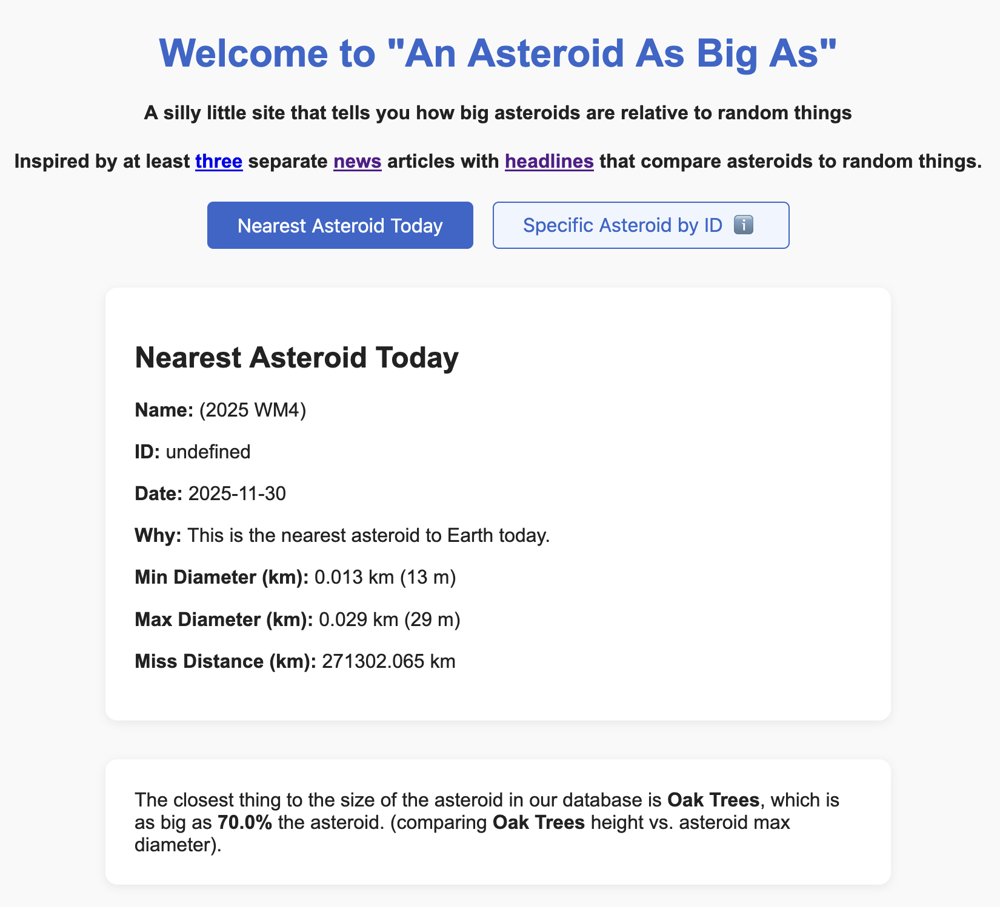

# AsBigAs

Kept seeing journalists write headlines about
upcoming asteroid as big as 12 girafes or 52 gorrilas,
so decided to make a little website to automate silly
size comparisons between upcoming asteroids or any asteroid
and arbitrary things.

Original idea to make an API for this can be found
in the [idea.md](./idea.md) file.

## Live site

Page is live at https://justingosses.github.io/AsBigAs/

## Status

Currently just a first draft written in COVID isolation
trying to figure out how much brain power I have back.

## Data

### Asteroid data

#### Nearest astroid

Pulls from the NEO API described on [https://API.nasa.gov](https://API.nasa.gov) to find the asteroid passing most
closely to earth today. The API URL used is something like
`https://api.nasa.gov/neo/rest/v1/feed?start_date=2025-05-28&end_date=2025-05-28&api_key=DEMO_KEY`
For specific astroid lookups, it uses a slightly different
format `https://api.nasa.gov/neo/rest/v1/neo/3542519?api_key=DEMO_KEY`.

#### Find astroid ID 

- Go to https://cneos.jpl.nasa.gov/ca/
- Filter to your asteroid
- Go to its page, such as https://ssd.jpl.nasa.gov/tools/sbdb_lookup.html#/?sstr=2025%20WU9
- Find the SPKID, such as 54564352 
- Use that ID to look up how big the asteroid is relative to other things on https://justingosses.github.io/AsBigAs/

## Contributing

Contributions are welcome! Want to add your own silly thing to compare asteroids to? We'd love to have it! See our [CONTRIBUTING.md](./CONTRIBUTING.md).